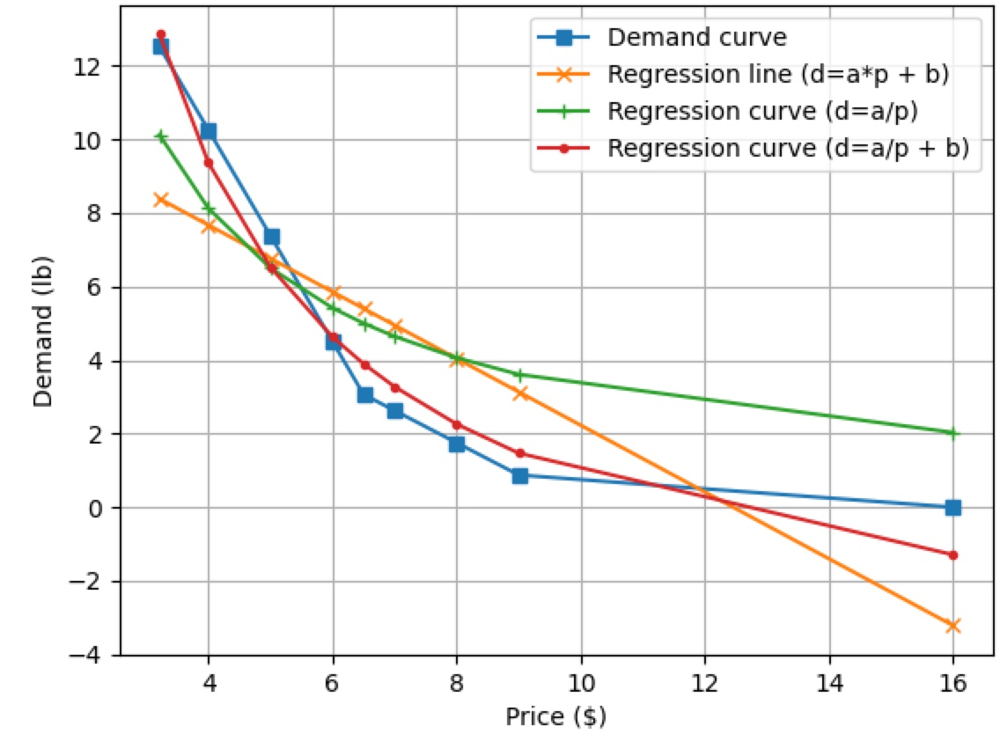
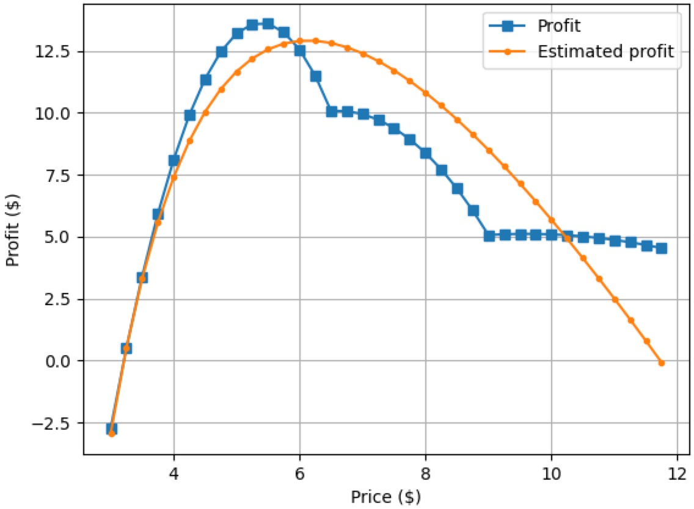

# Statistical and Demand-based Pricing Analysis

I run a ["business"](https://italian19.blogspot.com/) that produces fresh pasta. I wanted reasonable pricing strategies for my pasta because I used to price them randomly. So I learned and implemented 3 pricing strategies 

- I checked the prices of fresh pasta at local stores, calculated their statistics such as mean, median, mode and quartiles, and priced my pasta in comparison to those stats. See the ["code/stats" folder](./code/stats/). 
- I estimated the customer demand of my pasta, expressed it as a demand curve, and calculated the most profitable price based on the demand curve. See the ["code/demand" folder](./code/demand/). 
- I found a regression curve that has the best fit to a demand curve, and calculated the most profitable price based on the regression curve. See the ["code/demand" folder](./code/demand/). 

  
  

This code base requires Python 3, [SciPy](https://scipy.org/) and [Matplotlib](https://matplotlib.org/). 

I wrote this set of code in August 2022 to work on a summer research project. See a [research report](https://drive.google.com/file/d/11Ve25t66MUfaCeax15RPoRMIbAaji_vr/view?usp=sharing) and a [poster presentation](./images/poster-presentation.jpg), both written in Japanese, if you can read Japanese. :smile: 
